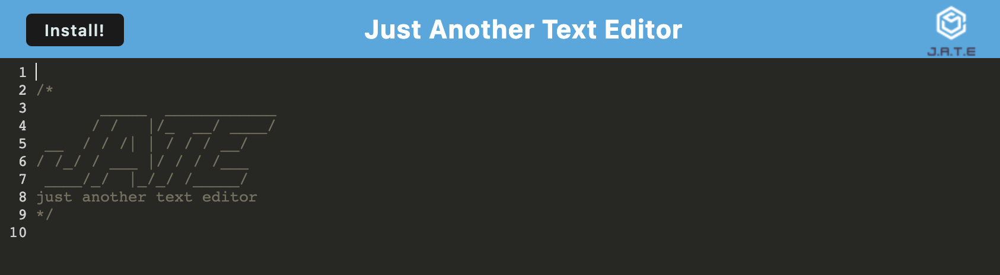
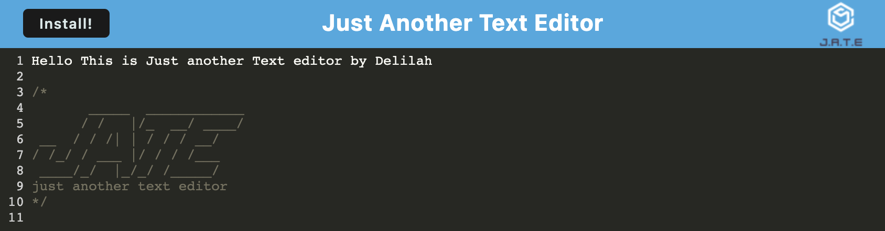

# Nifty-Text-Editor

## GitHub Repository & Deployed Application
* https://github.com/ila0406/Nifty-Text-Editor
* https://nameless-castle-87578.herokuapp.com/

## 
* [Description](#description)
* [Technolgies Used](#technolgies-used)
* [Installation Instructions](#installation-instructions)
* [Usage Info](#usage-info)
* [Contribution Guide](#contribution-guide)
* [Instructions for testing](#instructions-for-testing)
* [Questions](#questions)
* [Screenshots](#screenshots) 

## 
This text editor runs in the browser but can be installed locally as a PWA.
## 
* Javascript 
* CSS
* PWA 
* Express JS
* Node JS
* concurrently
* Babel
* Webpack

## 
1) Run > `npm i` to install node packages 
2) Run > `npm run build` to run build script
3) Run > `npm start` to begin program

## 
This text editor allows you to type text into an editor. Anything you've typed will be saved regardless of closing the app. You can click the install button at the top left in order to install the app locally. Installing locally will allow you to use the Text Editor.

## 
Framework was provided as part of the homework assigment, used mini project from 19-28 as a reference. 

## 
No tests provided, so just install and test yourself

## 

## 
If you have questions, you can either open a issue in my Github repository  
GitHub: <https://github.com/ila0406>  
 
Or you can send me an email directly  
Email: <ila0406@gmail.com>
